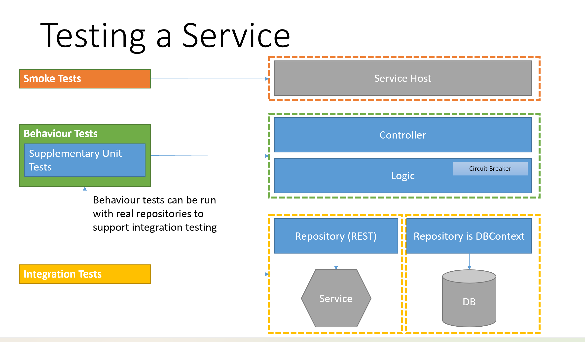
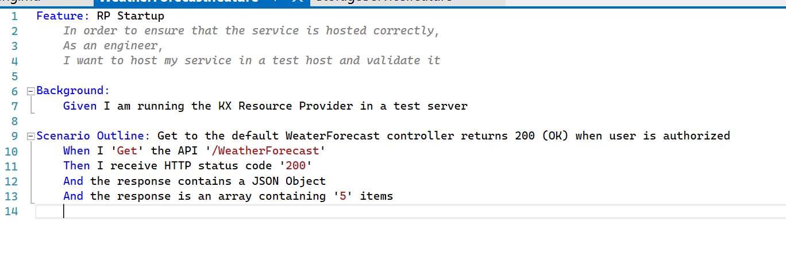

# Overview
This document details the code testing and release strategy for the KXRP Project.

[[_TOC_]]

Decisions
- What types of tests do we want?
- What testing framework/tool will we use for these?
- Do we want to use specflow?
- Do we want to use code analysis tools?
- Do we want to do code coverage analysis?
- Mocks vs Stubs vs Fakes - What do we want?

Topics we need to learn
- In memory web server testing for .NET [Integration tests in memory](https://docs.microsoft.com/en-us/aspnet/core/test/integration-tests?view=aspnetcore-6.0)
- Mocking/Stubs/Fakes - whichever we choose
- Test tool  whichever we choose

Considerations
- .NET 6 changes to set-up/testing

# Suggestions for types of tests to perform

## Unit test
Short, isolated tests and are executed against emulators and are focused on behavioural validation (not integration). Unit tests are always mocked or use and emulator.

- These will probably use mocks for simplicity

### What to test?
- Test the positive case
- Test negative cases
- Almost anything can be tested, so when defining the spec, don�t worry about how you will test!
- Test ranges, including null
- Test conditional and branching logic
- Don't try and test framework/platform code
- API Validation for example
- Aim for high test coverage, but know that 100% isn�t achievable

## Integration tests

Checks that the service is able to integration with its own and remote repositories.  No repositories should be emulated during these tests.

Integration tests in ASP.NET Core require the following:

A test project is used to contain and execute the tests. The test project has a reference to the SUT.
The test project creates a test web host for the SUT and uses a test server client to handle requests and responses with the SUT.
A test runner is used to execute the tests and report the test results.
Integration tests follow a sequence of events that include the usual Arrange, Act, and Assert test steps:

- The SUT's web host is configured.
- A test server client is created to submit requests to the app.
- The Arrange test step is executed: The test app prepares a request.
- The Act test step is executed: The client submits the request and receives the response.
- The Assert test step is executed: The actual response is validated as a pass or fail based on an expected response.
- The process continues until all of the tests are executed.
- The test results are reported.

Usually, the test web host is configured differently than the app's normal web host for the test runs. For example, a different database or different app settings might be used for the tests.

## Smoke/Middlewear Tests
Smoke testing ensures that the service is hosted correctly and ready for use.

Essentially testing the middleware.

 It must be run on each environment where the service is deployed and must not change the system. Smoke testing involves a light integration test with Azure AD for authentication Smoke testing examples:
- Simple / transaction where available
- Bearer validation: Unauthenticated (no bearer present), valid user bearer, valid app bearer
- Correct service is hosted (validate version for service and node deployment)
To support Smoke testing, a Smoke API Controller must be used (/api/smoke).

## Health Tetss
easily can add health endpoints for the system.

# Testing a service

## Personal opinion on Mocks vs Stubs vs Emulators(Fakes)
There is a debate as to whether or not you should use Mocks vs Stubs vs Emulators(Fakes) in testing. In the past I have used fakes and swapped these in and out as needed in both unit and integration tests - I think this works really well.

However, for simplicity, we may choose to use [Moq](https://github.com/Moq) in our unit tests for creating mocks of objects to do testing.
We could then do our x2 types of integration tests using fakes and swap them in and out when necessary.

# Testing frameworks & tools
Review following document for full information: [Testing in .NET
](https://docs.microsoft.com/en-us/dotnet/core/testing/) and [Comparison of tools2020 edition](https://www.c-sharpcorner.com/UploadFile/Santhi.M/comparison-of-unit-testing-tools-in-net/)

## Testing tool options
- XUnit
- MSTest
- NUnit

Suggestion: If I had to say, probably XUnit as Liftr team uses it and its open source but really not sure it matters - but all will work.

## Specflow
Works as an ADDITION to the above - so you choose your flavour or tool and then configure specflow with this - Specflow+XUnit for example.

## What is it
[Official docs](https://specflow.org/)
SpecFlow is a test automation solution for .NET built upon the BDD paradigm. Use SpecFlow to define, manage and automatically execute human-readable acceptance tests in .NET projects (Full Framework and .NET Core).

SpecFlow tests are written using Gherkin, which allows you to write test cases using natural languages. SpecFlow uses the official Gherkin parser, which supports over 70 languages.

Example test:

Pros: 
- Encourage BDD & closely algins with acceptance criteria/promotion of thinking about what you are actually trying to test
- New for the team to learn
- Very flexible 

Cons:
- Another new thing for the team to learn
- Can be abit fussy to set up/get head around - how much value will we get from this?

### Why do we need it?
Well, we dont *need* it, but I think its good to make the tests human readable and also encourage you to have a BDD mindset.

Suggestion: I have worked with it before and it can be really good but does require effort. Don't have to use it for both Int and Unit, could choose or not at all.

# Compilers and Analyzers
- The first check for quality of code is at compiler time, where the language compiler and any configured analysers are invoked
- Compilers ensure that the code can be built correctly in the desired configuration (debug / release / platform)
- Analyzers ensure that the code meets the defined standards for the code.  Example analyzers are Code Analysis (formally FxCop) and StyleCop

Suggestion: Adopt and use Stylecop

# Code coverage
Do we want to enforce code coverage checks? 